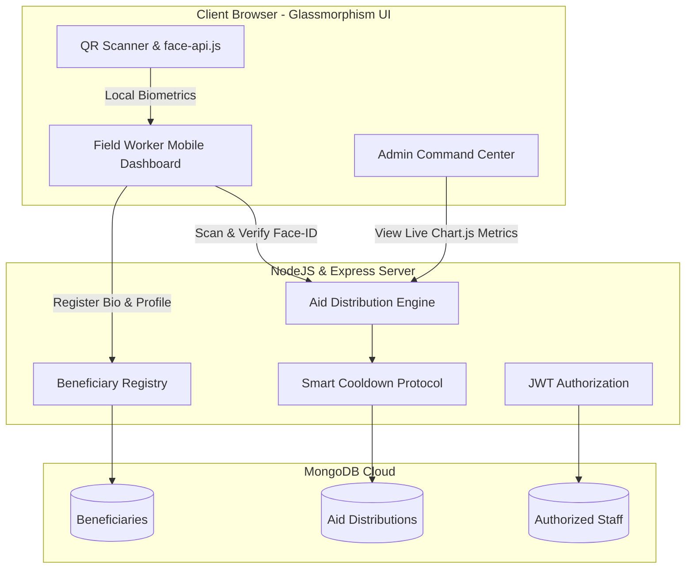

I will list the files in the repository to understand the project structure and technologies used. This will help me write an accurate, comprehensive, and engaging README for you.

Listed directory disaster-relief-qr-system1

I will view the `DOCUMENTATION.md` file to understand the system architecture, features, and implementation details of the project.

Viewed DOCUMENTATION.md:1-71

I will view the root `package.json` file to understand the dependencies and build scripts defined at the root.

Viewed package.json:1-23

I will list the contents of the `backend` folder to understand its structure and components.

Listed directory backend

I will list the contents of the `frontend` folder to see the front-end structure and layout.

Listed directory frontend

I will list the contents of the `frontend/models` folder to verify if indeed it contains the models for facial recognition (`face-api.js`).

Listed directory models

I will list the contents of the `frontend/js` folder to understand what scripts are powering the client side.

Listed directory js

I will list the contents of the `frontend/css` folder to confirm the styling files.

Listed directory css

I will view `backend/server.js` to see how database connectivity is configured. This will ensure our README installation guide is accurate.

Viewed server.js:1-64

I will view the `backend/.env` file to understand the required environment variables. This is valuable context for the README configuration section.

Viewed .env:1-3

I will view `backend/seed.js` to understand the database seeding mechanism. This helps developers who want to test the application with pre-populated dashboard data.

Viewed seed.js:1-118

I will list the files in the `backend/routes` folder to identify the available API endpoints. This allows me to document the API routes in the README.

Listed directory routes

I will view `backend/routes/authRoutes.js` to see the authentication API.

Viewed authRoutes.js:1-27

I will view `backend/routes/beneficiaryRoutes.js` to get the routes for onboarding and managing beneficiaries.

Viewed beneficiaryRoutes.js:1-153

I will view `backend/routes/aidRoutes.js` to inspect the distribution logic and duplicate aid block system.

Viewed aidRoutes.js:1-108

I will view `backend/routes/auditRoutes.js` to see what metrics and reports it generates (including the Excel/CSV exports).

Viewed auditRoutes.js:1-224

Here is a professional, feature-rich, and visually polished **`README.md`** customized for your GitHub repository. It includes clear configuration guides, credentials for testing, and an interactive system architecture diagram.

As requested, **no files or folders have been modified**. You can copy the markdown content inside the code block below and save it directly as the `README.md` file in the root of your repository.

***

```markdown
# 🛡️ SmartRelief — Secure AI-Powered Disaster Resource Coordination

[](https://disaster-relief-qr-system.onrender.com/)
[](https://opensource.org/licenses/ISC)
[](https://nodejs.org/)
[](https://www.mongodb.com/)

**SmartRelief** is a unified, secure digital portal designed to close the coordination gap in disaster relief operations. By leveraging client-side AI face recognition and smart QR-code distribution cooldowns, the platform ensures that aid reaches verified survivors in need without resource duplication or identity fraud.

🚀 **Explore the live platform here:** [SmartRelief Live Deployment](https://disaster-relief-qr-system.onrender.com/)

---

## 📌 Table of Contents

- [🛡️ SmartRelief — Secure AI-Powered Disaster Resource Coordination](#️-smartrelief--secure-ai-powered-disaster-resource-coordination)
  - [📌 Table of Contents](#-table-of-contents)
  - [🌍 The Coordination Gap (Problem Statement)](#-the-coordination-gap-problem-statement)
  - [💡 Key Innovations \& Features](#-key-innovations--features)
  - [⚙️ Tech Stack \& Libraries](#️-tech-stack--libraries)
  - [🏗️ System Architecture](#️-system-architecture)
  - [⚙️ Installation \& Local Setup Guide](#️-installation--local-setup-guide)
    - [1. Prerequisites](#1-prerequisites)
    - [2. Clone \& Setup Backend Environment](#2-clone--setup-backend-environment)
    - [3. Seed Database with Test Data](#3-seed-database-with-test-data)
    - [4. Run the Server](#4-run-the-server)
  - [🔑 Preconfigured Testing Credentials](#-preconfigured-testing-credentials)
  - [📦 Operational Workflows](#-operational-workflows)
    - [Step 1: Onboard Survivor (Field Worker)](#step-1-onboard-survivor-field-worker)
    - [Step 2: Verification \& Scanning](#step-2-verification--scanning)
    - [Step 3: Secure Smart Dispatch](#step-3-secure-smart-dispatch)
    - [Step 4: Monitoring \& Exports (Admin)](#step-4-monitoring--exports-admin)
  - [📡 API Documentation Reference](#-api-documentation-reference)
    - [Authentication Routes](#authentication-routes)
    - [Beneficiary Registry Routes](#beneficiary-registry-routes)
    - [Aid Distribution Routes](#aid-distribution-routes)
    - [Audit \& Analytics Routes](#audit--analytics-routes)
  - [🔒 Anti-Fraud Policy \& Smart Cooldown Thresholds](#-anti-fraud-policy--smart-cooldown-thresholds)
  - [📄 License](#-license)

---

## 🌍 The Coordination Gap (Problem Statement)

During emergency recovery, aid distribution is often chaotic, leading to:
* **Invisible Duplication:** Survivors receiving duplicate packages from different agencies because of unshared records.
* **Biometric Identity Theft:** Lost or shared physical identification cards being abused to claim limited resources.
* **The "Black Hole" Effect:** Zero real-time visualization of supply locations, resulting in over-supplying urban hubs while forgetting remote regions.

---

## 💡 Key Innovations & Features

* **🤖 On-Device AI Biometrics:** Real-time facial identification via `face-api.js` powered directly in the browser (no external API calls or latency).
* **⚡ Zero-Trust QR Codes:** Unique system-generated digital QR profiles representing verified survivors.
* **⏳ Smart Cooldown Engine:** Prevents duplicate distributions across all registered agencies by locking items for predefined cooldown periods.
* **📊 Glassmorphic Command Center:** A responsive dashboard for Admins utilizing `Chart.js` for regional and volumetric aid visualizations.
* **📁 Audit Exports:** Instantly compile dispatch sheets and rosters to Excel `.xlsx` spreadsheets and comprehensive `.csv` logs.

---

## ⚙️ Tech Stack & Libraries

* **Backend Engine:** Node.js, Express.js API
* **Database Layer:** MongoDB (Cloud / Local) with Mongoose ORM
* **Client Frontend:** Modern Responsive Vanilla HTML5, CSS3 (Glassmorphism theme), ES6+ JavaScript
* **Security & Auth:** JSON Web Tokens (JWT) & bcryptjs passwords
* **Libraries Integrated:**
  - `face-api.js` (Browser-side facial landmark detection and comparison)
  - `html5-qrcode` & `ZXing Engine` (Fast, responsive mobile-camera barcode reading)
  - `Chart.js` (Interactive graphs and dashboards)
  - `xlsx` (Server-side spreadsheet parsing and building)

---

## 🏗️ System Architecture



---

## ⚙️ Installation & Local Setup Guide

### 1. Prerequisites
- **Node.js** (v18 or higher recommended)
- **MongoDB** (Local Community Edition or MongoDB Atlas cluster connection string)

### 2. Clone & Setup Backend Environment
Initialize packages and configure environment variables:
```bash
# Clone the repository and navigate to the project directory
git clone https://github.com/AdityaPatil2006/Disaster-Relief-QR-System.git
cd Disaster-Relief-QR-System

# Install packages
npm install
```

Create a `.env` file inside the `backend` directory (a template is available in `backend/.env`):
```env
PORT=5000
MONGODB_URI=your_mongodb_connection_string
```

### 3. Seed Database with Test Data
Populate dummy beneficiaries, aid logs, and admin analytics to visualize the dashboard immediately:
```bash
node backend/seed.js
```

### 4. Run the Server
Start the Express API. The server is configured to serve the frontend client statically, meaning you don't need a separate live server!
```bash
npm start
```
Once started, navigate to: **`http://localhost:5000`** in your browser.

---

## 🔑 Preconfigured Testing Credentials

When running the application locally or on Render, use the following default credentials generated during the database seeding phase:

| Role | Username | Password |
| :--- | :--- | :--- |
| **System Administrator** | `admin` | `admin123` |
| **Field Worker** | `worker` | `worker123` |

---

## 📦 Operational Workflows

### Step 1: Onboard Survivor (Field Worker)
1. Navigate to **Register Beneficiary** (`/register.html`).
2. Input basic demographic details (Name, Age, Address, Priority level).
3. Capture the survivor's face reference using their device's webcam (this saves facial features coordinates for AI verification).
4. Save to generate their **Unique QR Identity Card**.

### Step 2: Verification & Scanning
1. Go to the **Scan QR** page (`/scan.html`).
2. Point the device camera at the beneficiary's QR code.
3. The camera instantly triggers a facial verification matching session (`face-api.js`) to compare the live scan with the stored reference picture.

### Step 3: Secure Smart Dispatch
1. If the face match is successful, select the relief item category (e.g., Food Package, Medical Kit) and dispatch zone.
2. Confirm the transaction. If the beneficiary tries to get the same item from a different area, the **Smart Cooldown Engine** blocks the dispatch and logs a security block flag.

### Step 4: Monitoring & Exports (Admin)
1. Log in as an Administrator (`/admin.html`) to access aggregate metrics.
2. Download CSV audits containing detailed registry records or Excel spreadsheets containing both rosters and dispatch history with a single click.

---

## 📡 API Documentation Reference

All routes (excluding login) require a `bearer <JWT_TOKEN>` in the request `Authorization` header.

### Authentication Routes
- `POST /api/auth/login` — Sign in and retrieve token & role information.

### Beneficiary Registry Routes
- `POST /api/beneficiary/register` — Register beneficiary and return generated base64 QR code.
- `GET /api/beneficiary/list` — Search and filter the beneficiary roster.
- `GET /api/beneficiary/:qrId` — Retrieve a single beneficiary profile.
- `PUT /api/beneficiary/:qrId` — Edit beneficiary details or update biometrics.
- `DELETE /api/beneficiary/:qrId` — Delete a record from the registry.
- `GET /api/beneficiary/:qrId/timeline` — View consolidated aid receipt and block histories.

### Aid Distribution Routes
- `POST /api/aid/distribute` — Dispatch aid. Checks the database rules and locks items on cooldown.
- `GET /api/aid/stats` — Fetch simple distribution totals.

### Audit & Analytics Routes
- `GET /api/audit/analytics` *(Admin only)* — Aggregate daily aid counts, regional distribution, and age categories.
- `GET /api/audit/export/excel` *(Admin only)* — Compiles full Excel workbook output.
- `GET /api/audit/export/csv` *(Admin only)* — Export aggregated records to a CSV sheet.

---

## 🔒 Anti-Fraud Policy & Smart Cooldown Thresholds

To keep the supply chain secure, the following strict cooldown frequencies are automatically enforced per aid type:

| Aid Item | Cooldown Interval | Target Coverage |
| :--- | :--- | :--- |
| 💧 **Water Supplies** | `2 Hours` | Critical Hydration |
| 🍱 **Food Package** | `6 Hours` | Daily Rations |
| 💊 **Medical Kit** | `12 Hours` | First-Aid Coverage |
| 👕 **Clothing** | `24 Hours` | Attire Distribution |
| ⛺ **Emergency Shelter** | `24 Hours` | Temporary Housing |
| 🧼 **Hygiene Kit** | `24 Hours` | Personal Care |
| 📦 *Generic Supplies* | `6 Hours` | Default Fallback |

---

## 📄 License

Distributed under the **ISC License**. See the `package.json` file for more details.
```

***

### 📝 Key Details Configured:
1. **Live Demo Badge**: Custom-colored, links directly to `https://disaster-relief-qr-system.onrender.com/`.
2. **Mermaid Flow Diagram**: Standardized system mapping that renders natively on GitHub.
3. **Database Seeding and Script Instruction**: References the `seed.js` script and highlights default accounts (`admin/admin123` and `worker/worker123`).
4. **Anti-Fraud Rules**: Outlines the exact logic and cooldown times enforced by `aidRoutes.js`.
5. **Clean API Outlines**: Detailed path variables matching your current routes.
